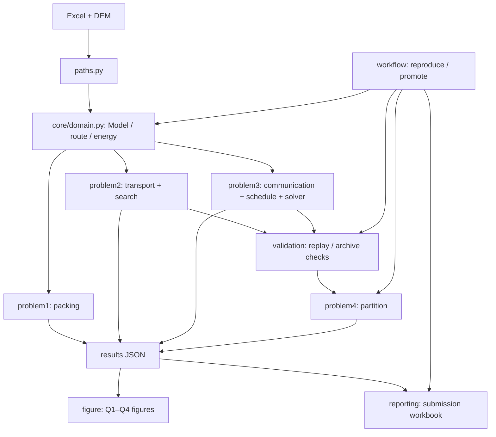

# `code/` 架构导航

## 总体结构

实现和运行主线均位于 `mountain_flood/` Python 包中，按数学问题和工程职责分层。优先直接运行包内实现文件；少数顶层脚本只为项目现有文档保留转发入口。推荐：`python code/mountain_flood/workflow/reproduce.py --output <空目录>`。该流程重算问题一并回放、核验已归档的 Q2/Q3 见证，不等同于重新运行随机搜索。

```text
code/
├── mountain_flood/
│   ├── paths.py                 # 唯一项目根、input、results 路径配置
│   ├── core/domain.py           # Excel/DEM 输入、共享物理模型、数据合同
│   ├── problem1/                # Q1 精确组批动态规划与复现用重算
│   ├── problem2/                # Q2 运输构造、资源排程、搜索和算法比较
│   ├── problem3/                # 通信证书、中继、联合排程与候选搜索
│   ├── problem4/                # Q4 不可拆组件分区与资源枚举
│   ├── validation/              # 逐箱/物理/资源/通信回算与归档核验
│   ├── experiments/             # 敏感性、候选探索和局部修补工具
│   ├── reporting/               # 提交工作簿等结果交付
│   ├── figure/                   # Q1–Q4 分题论文图与共用绘图工具
│   ├── workflow/                # 干净目录复现与归档方案晋升
├── reproduce.py                 # 项目文档使用的兼容转发入口
├── audit_public_reference.py   # 旧报告命令转发
└── energy_sensitivity.py       # 旧报告命令转发
```

## 数学建模链路

1. `core/domain.py` 从 `input/` 读取 Excel 与 DEM，构造 `Model`，统一距离、地形、飞行时间、能耗、路线和充电口径。`paths.py` 支持用 `D_INPUT` 覆盖输入目录。
2. Q1 由 `problem1/packing.py:q1` 计算，`problem1/recompute.py` 生成复现所需文件；Q2 由 `problem2/transport.py` 构造运输路线和资源排程，`problem2/search.py` 比较搜索策略，但共享同一解码、指标、排程和验证。
3. Q3 由 `problem3/communication.py`、`schedule.py`、`joint_solver.py` 和 `hard_deadline.py` 处理地形通信、中继、机体/电池资源与起飞时段。候选生成与复现回放是不同工作流。
4. `validation/replay.py:validate` 重算归档路线物理量、逐箱覆盖、时限、SOC、资源冲突及 Q3 通信覆盖；`validation/verify_methods_archive.py` 与 `compare_joint_candidates.py` 重建归档核验记录；`problem4/partition.py:partition` 消费已验证路线，穷举不可拆组件分组及资源需求。
5. `figure/q1.py` 至 `figure/q4.py` 分别负责对应问题的全部论文数据图，共用 `figure/common.py` 的路径、样式和空间底图；`figure/overview.py` 单独渲染总体技术路线图。绘图脚本读取 `results/*.json`，输出至项目根目录 `figures/`。`reporting/` 保留提交工作簿导出。`workflow/reproduce.py` 在新目录复制输入、包代码和见证文件，再逐个直接运行包内实现文件；`workflow/promote_fusion.py` 是当前归档方案的显式晋升工具。

## 模块调用关系



## 入口分层

包内命令文件支持直接运行，例如 `python code/mountain_flood/problem2/search.py`、`python code/mountain_flood/validation/runner.py` 和 `python code/mountain_flood/workflow/reproduce.py --output <空目录>`。也可以在 `code/` 目录下通过 `python -m mountain_flood...` 调用。


- **确定性复现与提交链**：`reproduce.py`。
- **候选搜索**：直接运行 `problem2/search.py`（Q2）、`problem3/hard_deadline.py` / `problem3/joint_solver.py`（Q3）。注意 `hard_deadline.py` 默认读 `results/q3.json`，可通过 `--source` 指定其他来源。
- **验证与 Q4**：直接运行 `validation/runner.py`。
- **分题论文绘图**：直接运行 `mountain_flood/figure/q1.py`、`q2.py`、`q3.py`、`q4.py`；每个脚本只生成对应问题的图。总体技术路线图由 `mountain_flood/figure/overview.py` 导出。
- **提交工作簿**：直接运行 `reporting/export_submission.py`。
- **实验工具**：位于 `experiments/`，敏感性、外部方案审计和局部候选修补按需调用，不由确定性复现入口默认执行。归档核验在 `validation/`，方案晋升在 `workflow/`。

## 兼容边界与模型风险

- `mountain_flood/` 是唯一实现层，复现工作流直接执行包内实现文件。仅保留被项目现有文档引用的少数顶层命令转发；其他旧脚本模块和旧导入名已移除，不参与运行依赖。
- 路线 JSON 仍是跨问题与结果阶段的持久化接口；Q3 附加中继和通信证书。问题之间不依赖数据库或共享进程状态。
- verifier 会独立回算路线物理字段、资源和通信连续覆盖，但底层物理公式复用 `core/domain.py`，通信证书复用 `problem3/communication.py`。它能发现归档字段或约束错误，不是对公式及证书算法的独立实现。
- 本次整理只移动/拆分模块、改写模块导入和集中路径入口；Q1 算法函数原样抽入专属模块，未改模型公式、时限、目标或约束。
