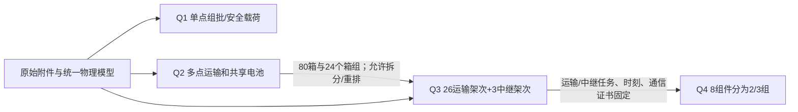

# 当前方案一致性审计报告

审计日期：2026-09-25。审计基准：`input/` 原始附件、`config/` 统一假设与搜索设置、`results/q1_rho20.json`、`q2.json`、`q3.json`、`q4.json`、`paper/sections/*.tex`。审计方式包括逐箱与逐航次独立回放、连续通信重新认证、隔离目录完整复现、提交表逐行核对、论文关键表格数值核对、论文图文件/生成代码/结果文件追溯。`check_consistency.py` 最终返回 **PASS，0项错误、0项备注**；19页正式PDF已由更新后的LaTeX和图组重新生成，并完成文字提取与抽页视觉检查。

## 1. 当前方案整体结构及唯一事实源

`input/` 是题设数据；`config/base_parameters.json` 记录题面未直接写在附件表中的统一假设，`config/optimization_parameters.json` 记录算法预算、种子和证书设置；`core/domain.py::Model` 从附件读取服务区、货箱、运输机、中继机和通信端点，计算同一 DEM 上的距离、净空、时间、能耗和截止。当前正式结果由 `workflow/promote_fusion.py` 显式选取归档可行见证并独立回放。`reporting/export_submission.py` 用正式 JSON 导出8张提交工作表。`figure/generate.py` 读取同一 JSON 生成独立图组。论文 LaTeX 源引用本次审计图组 `figures/audit_verified_20260925/`。

Q1用计数状态动态规划求各服务区单点组批；Q2以同一物理模型构造多点运输，四种搜索法与统一CP-SAT排程比较；Q3在Q2箱组基础上拆分两条多站路线，联合安排运输与中继，逐段认证通信；Q4固定Q3任务和时刻，仅优化救援小组分区及独立资源配置。主方案为有限候选中的相对最优，不宣称整个混合离散空间的全局最优。

## 2. 全局参数表

完整 **835项** 参数/逐箱字段、单位、附件来源、Python变量、使用文件、所属问题和论文位置见 `reports/audits/parameter_registry.csv`。全项目48个Python文件中的1667处数值字面量另列于`reports/audits/python_numeric_literal_inventory.csv`，供识别历史调参、算法设置与绘图样式；参数总表只将有语义的当前参数列为基准。下表列出直接影响结果的共用值；单箱80组质量、体积、时限、类别和优先系数均在参数总表逐行列出。

| 参数组 | 当前数值 | 唯一来源/解释 |
|---|---|---|
| 任务空间 | O01中心、S001–S015服务区；WGS84；DEM 1309×1486，EPSG:4326 | 服务区附件与 `镇龙乡及周边30米DEM.tif`；同名两份DEM SHA256均为`741fe6de0b2b…`，代码固定读取根目录副本 |
| 货箱 | 80箱，758 kg，2.011 m³；医疗16箱；首批30箱；重合15箱，故硬截止覆盖31箱 | `物资需求与配送时限.xlsx`逐箱清单 |
| 时限 | 医疗期望时刻为硬约束；首批截止为硬约束；其他物资期望时刻为软及时性指标 | 附件逐箱字段及当前题意口径 |
| 运输机 | A/B/C实体机4/2/2；载重25/30/80 kg；容积0.060/0.073/0.250 m³；巡航12/15/15 m/s | `运输无人机数据.xlsx` |
| 运输电池 | A/B/C各6/4/4组；可用4.5/4.0/8.0 kWh；充满时间1800/2400/3000 s；返航储备20% | 同上；初始满电，两阶段充电折点90% |
| 中继 | R型2架，组件6组；3.2 kWh/组，20%储备，1800 s充满；巡航15 m/s；悬停1.05 kW、通信附加0.05 kW；最大离地300 m | `中继无人机数据.xlsx` |
| 通信 | 2400 MHz、系统损耗3 dB、遮挡附加10 dB、灵敏度−98 dBm、衰落裕量8 dB；双向门限直连122、接入116、回传126 dB | `通信链路参数.xlsx`，由双向端点参数推导，不再分别硬编码 |
| 飞行规则 | 地形净空50 m；服务区作业高度地面+30 m；重力加速度9.81 m/s²；水平等效航程+爬升能耗 | 附件和 `config/base_parameters.json` |
| 四法预算 | GRASP/爬山/退火/禁忌，各种子0、1、2，各搜索6 s，固定箱组排程8 s，CP-SAT种子42 | `config/optimization_parameters.json` 与归档`method_comparison.json` |
| Q3证书 | 初分段10 s、最大递归深度6、距离保守因子1.0002；中继候选网格750 m | `config/optimization_parameters.json` |

所有计算以 m、s、kg、kWh、dB 为内部单位。论文的 min、百分比和 kWh/kg 均在展示层换算。未发现 kg/g、m/km、s/min、Wh/kWh、SOC 0–1/% 混用造成的当前结果错误。论文 `\bar D_\pi` 是加权**平均**，JSON `weighted_arrival` 是加权**总和**（系数·s）；表中分钟数按总优先系数和60换算。

## 3–4. 多模型参数对齐与比较公平性

`reports/audits/model_comparison_alignment.csv` 逐项给出GRASP、爬山、退火、禁忌及历史参照的17项条件。四种**本轮**算法共享相同的80箱、DEM、8架机、14组电池、20%储备、医疗/首批硬时限、软迟到定义、能耗函数、三个种子起点、6 s搜索和8 s同一CP-SAT排程器。爬山、退火、禁忌搜索共用5类邻域；随机化构造以重新构造为搜索动作。每法3/3方案通过独立物理/时限/资源回放。方法的温度、邻域采样、禁忌表及输出架次数属于设计差异，不要求相同。Q2不施加Q3才引入的通信条件，属于题目场景差异。

| 本轮方法 | 3次中最佳软迟到（系数·s） | 最佳运输收尾/min | 最佳能耗/kWh | 最佳架次 |
|---|---:|---:|---:|---:|
| 随机化构造 | 155.67 | 146.39 | 72.94 | 23 |
| 局部爬山 | 0 | 116.89 | 78.38 | 26 |
| 模拟退火 | 0 | 126.65 | 85.07 | 29 |
| 禁忌搜索 | 0 | 130.50 | 88.87 | 27 |

提交的24架次Q2方案来自**上一轮更严格时限口径的爬山种子1**，在当前规则下重新回放后为104.61 min、71.9169 kWh、零软迟到。它是跨轮历史参照，不计作本轮四算法的第5个同预算样本。论文已写明此点；因此只能说它在“已验证的12个本轮候选+1个历史候选”中排序最好，不能据此声称它是本轮6 s预算的爬山胜者。Q3的29套归档候选具有同一现行硬约束与评价口径，但箱组来源和中继窗口属于设计变量，求解预算/搜索空间不构成严格随机算法公平试验；论文只作有限候选比较。

## 5. 同一模型从读取到论文的参数链

运输机、安全余量、充电时间、逐箱时限、通信端点和中继物理参数现在均由 `Model` 从附件读出；DEM由配置指定唯一文件。净空、高度、重力、充电折点、算法预算、搜索种子与主要方法参数由配置读入。重复的中继功率、能量、返航SOC和双向链路门限已在主求解、回放和Q4资源核算中合并。Q1的10/20/30/40%安全余量是明示敏感性场景，不是参数漂移。历史探索脚本中仍有少量独立调参常数；它们不用于当前正式结果的复现链，列为P3维护项。

## 6. Q1→Q2→Q3→Q4继承关系

Q2继承Q1的同一附件与运输物理规则，但Q1的18架次单点解**不是**Q2必须固定的箱组。Q3的26条路线均为Q2某条箱组的子集：T006、T021各拆成两条，其余22条保持箱集；Q3允许变更机型和起飞时刻以满足通信与硬截止，80箱目的地完全一致。Q4仅读取Q3的路线、任务时刻和通信使用记录，分区代码不调用路线优化器；8个不可拆组件覆盖全部15个服务区，26条Q3运输任务恰好各分配一次。两组127、三组966种分区的库存缺口分别为`(0,1,0,0,1,0,1,0)`和`(2,0,1,2,0,0,2,0)`。

## 7. 数学模型与代码对应

逐公式检查见 `reports/audits/equation_code_mapping.md`，覆盖载重、体积、航程、飞行时间、飞行/爬升能耗、返航储备、医疗/首批时限、软迟到、机体/电池占用、两阶段充电、中继能耗、DEM净空、LOS、FSPL、双向链路、连续通信、Makespan、多目标排序、Q4资源峰值。审计时发现“软迟到”代码此前对所有箱求和，而论文限定非医疗箱；由于医疗时限为硬约束，已验证方案数值本来等价，但仍改为显式只统计非医疗箱，防止将来口径漂移。Q3固定候选的CP-SAT `OPTIMAL`仅证明该固定模型的运输收尾，论文已限制全局最优表述。

## 8. 代码与实验结果、提交表

隔离目录 `/private/tmp/mountain_flood_audit_verified_20260925/` 按当前代码和输入完成全流程，`results/isolated_reproduction_manifest.json`保存该次完整哈希清单；当前项目 `results/experiment_metadata.json`记录Git HEAD、未提交状态、76项输入/代码/配置/论文源哈希、7项正式结果哈希、11张论文图哈希、PDF哈希、种子和指标。逐航次能耗、SOC、时长、时限、机体与电池重叠、Q3中继能耗/组件占用重新回算均通过。`D题结果提交表.xlsx`的Q2/Q3每条运输行和80箱逐箱交付行逐行与JSON一致；Q1/Q4总数与方案一致。

| 正式结果 | 实验重跑/回代值 | 状态 |
|---|---:|---|
| Q1 20%储备 | 18架次、59.131296 kWh | 可写论文 |
| Q2 | 24架次、6276.831436 s = 104.61 min、71.916857 kWh、31箱硬截止通过、零软迟到 | 可写论文 |
| Q3 | 26运输+3中继架次、6769.221554 s = 112.82 min、78.873199 kWh、4061段通信证书、零软迟到 | 可写论文；0.09378 dB最小裕量须保留限定 |
| Q4 | 2组和3组分区各穷举127/966种，缺口分别为3/7件 | 可写论文；独立配置均不能用现有库存直接执行 |

Q3旧方案的4箱普通水晚于期望时刻**仍存在于历史候选**，在现行规则下不违反硬截止，但收尾和能耗更差，未进入提交表。当前Q2/Q3主方案均没有软迟到。

## 9. 图表与结果文件

论文引用的**11张图文件、6张表**逐项见 `reports/audits/figure_result_mapping.csv`。新图组由当前`figure/{q1,q2,q3,q4,overview}.py`读取正式JSON生成，论文LaTeX直接引用 `figures/audit_verified_20260925/`，包含新增的Q3运输电池图。Q2算法图读取`method_comparison.json`，Q4两幅分区图读取`q4.json`和`q3.json`；没有发现当前论文图像缺失或图文件早于所依赖结果。6张论文表的Q1、四算法、Q3主方案、Q4资源向量和敏感性关键数字已由自动程序对照结果文件。旧根目录图文件保留作历史材料，正式LaTeX已不再引用它们。

## 10. 论文、符号、单位与结论

当前LaTeX源及重新编译的19页PDF中，关键数值104.61、71.9169、112.82、78.8732、4061、221.03和84.65与结果文件一致；Q1安全余量表、Q2四法表、Q3入选行、Q4资源向量表、能耗压力表经程序核对。`C_T`为运输最后返航，Q3联合收尾包含中继；Q1 `time`是累计作业时间，不能直接与Q2/Q3 Makespan比较。论文明确无排放因子，所以只报告任务耗电，不推算碳减排。文献的悬停与升阻比能耗式仅用于机理讨论，未冒充代码中已标定的求解公式。

## 11. 冲突、分级与处理

| 等级 | 发现 | 处理/当前状态 |
|---|---|---|
| P0 | 当前正式Q1–Q4未发现会使模型或结果错误的冲突 | 独立回放和隔离重跑通过 |
| P1 | 历史24架次参照来自不同预算/旧时限，若算进“四法同预算获胜”将不公平 | 论文与CSV明确单列历史参照；仅对本轮12次做同预算四法排序。历史方案只作当前规则下可行候选选择，**不宣称本轮公平竞赛冠军** |
| P1 | Q3 29候选的箱组与窗口不同，`OPTIMAL`只针对固定子问题 | 论文限定“有限候选相对最优”；保持为模型设计差异，无需强行同参数 |
| P2 | 论文此前引用根目录旧图`capacity/routes/relay_map/partitions`等，且Q3电池图无新生成源 | 已切换到本次独立图组；新增Q3电池图并更新引用 |
| P2 | 论文软迟到式只含非医疗箱，代码原先将医疗箱的恒零项也加入 | 已在指标和主排程器显式过滤医疗箱，重跑结果不变 |
| P2 | 论文曾写“四法共用五类邻域”，而GRASP只执行重新构造 | 已修正论文算法描述；爬山、退火、禁忌搜索共用五类邻域 |
| P2 | 此前 `paper/main.pdf` 与根目录 `D题论文.pdf`早于修订后的LaTeX源与新图 | 已用临时目录中的Tectonic 0.17.0编译19页PDF，复制到根目录；两份PDF哈希一致，中文标题及关键数字可提取 |
| P3 | DEM通过递归搜索选择路径、中继物理/链路/资源在多个脚本重复硬编码 | 已指定唯一DEM、从附件读取并合并到共享Model/配置；Q4库存由附件推导 |
| P3 | 部分历史探索脚本仍保留独立搜索调参常数；结果目录保留大量旧候选 | 历史结果以来源文件名和主结果选取清单隔离；若重新开展探索试验，应继续迁入配置并重新生成元数据 |

## 12. 已修复内容

新增统一配置2份和共享读取模块；运输安全余量按机型附件读取；中继与通信参数按附件读取并推导双向门限；问题四库存动态读取；修订正式论文图路径、算法描述并新增Q3电池图；显式软迟到统计范围；复现脚本复制配置、排除Office临时锁文件、校验新增图；建立自动参数/图/表/元数据审计脚本。全部修复保持原附件数值和已归档正式方案不变。

## 13. 尚需人工确认

- 封面中的学校、参赛队号和队员姓名仍留空，正式提交前由参赛队填写；填写后应再次编译PDF并运行一致性检查。
- Q3最小通信裕量0.09378 dB，且固定航次对水平能耗仅有0.5441%余量。现场执行前需重新测量地形/天气/链路；模型内可行不代表实地鲁棒保证。
- 若正式论文要使用“算法最优”一词，只能限定为本轮同预算四法内或已归档有限候选集内的相对最优，不能写全局最优。

## 14. 重新运行后的结果

`/private/tmp/mountain_flood_audit_verified_20260925/` 全流程返回PASS。Q1、Q2、Q3关键值与当前正式JSON一致；Q4两组/三组库存向量不变；8张提交工作表及完整图组生成成功。当前项目 `check_consistency.py --write` 建立审计表与元数据，随后不带参数再跑返回PASS且0项错误、0项备注；PDF两份文件哈希相同、可提取中文标题与关键指标。隔离重跑仅重算和回放，不伪称重做全部限时随机搜索；四法的原始12次搜索轨迹仍以`method_comparison.json`归档。

## 15. 最终论文可用状态

**可用于最终论文正文/表格：**Q1–Q4的当前指标、已验证的四法同预算对照、单列历史参照、联合候选对照、资源缺口、敏感性与现有限定性结论。**可用于排版：**`paper/main.tex`及`figures/audit_verified_20260925/`。**PDF状态：**`paper/main.pdf` 与根目录 `D题论文.pdf` 已同步为本次核对后的19页版本；文字、页数、图表引用及抽页视觉检查通过。封面身份字段须由参赛队填写。每次修改输入、代码、配置或正式结果后，运行 `.venv/bin/python check_consistency.py --write` 更新审计元数据，再运行 `.venv/bin/python check_consistency.py` 检查；正式图需要重新生成新图组并更新论文路径。
